# Marcha Social Payment App


## Description

Conventional transactions that use physical cash in the process we often do everyday, but these conventional transactions have several problems such as:
1. Transactions can only be done when they meet, so it can be said to be less efficient and less fast.
2. With the Covid-19 pandemic, conventional transactions can be a problem because the virus can easily spread through physical cash, besides that physical distancing also makes it difficult to meet.
3. We often do not know the entry and exit of money correctly, so that it can lead to poor financial planning.
4. Difficulty in managing complex transactions such as dividing payments, or making payments in groups.
5. Often we forget to pay our debts, and we often feel awkward when we collect other people's debts.

Therefore, we from the ORBIT team developed an application called Marcha, Marcha is a social payment application that provides various features that you can use to make digital transactions. In addition to digital financial transactions, we also focus on building a fun and interactive environment in our application, the goal is to make it easier for users to make digital transactions with friends and family without feeling awkward because it is related to money.

## Table of Contents

If your README is long, add a table of contents to make it easy for users to find what they need.

- [Usage](#usage)
- [Features](#features)

## Usage

**Step 1:**

Download or clone this repo by using the link below:

```
https://github.com/codeyzx/marcha.git
```

**Step 2:**

Go to project root and execute the following command in console to get the required dependencies: 

```
flutter pub get 
```

**Step 3:**

Run or Start Android Emulator 

**Step 4:**

Run application by using the command below:

```
flutter run
```


## Features

* Onboarding

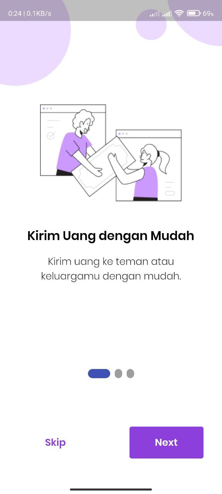

* Login

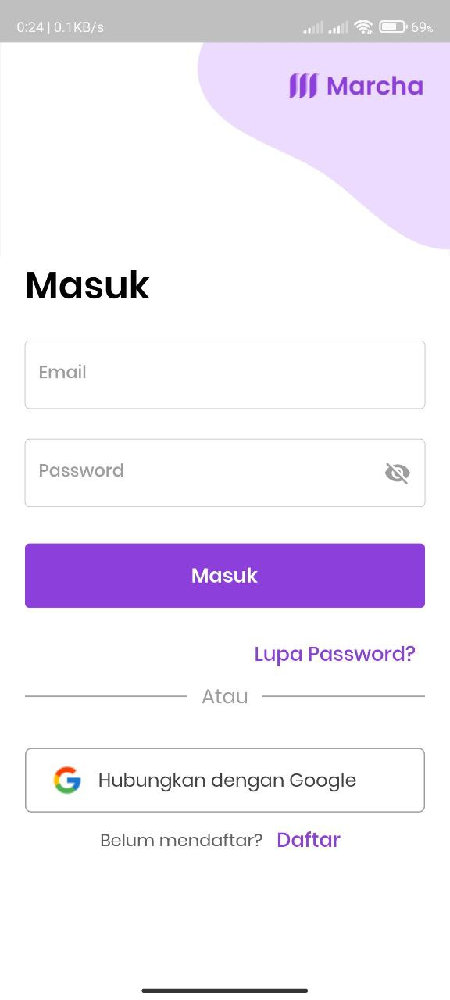

* Home Page

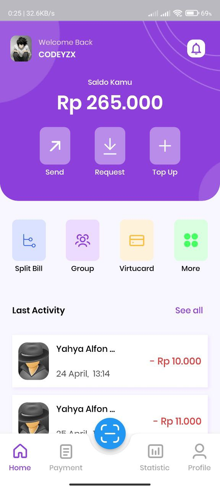

* Send


* Request


* Split Bill

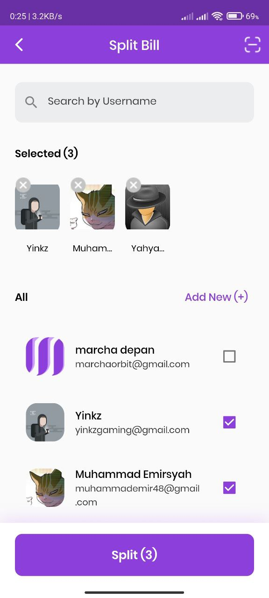

* Group

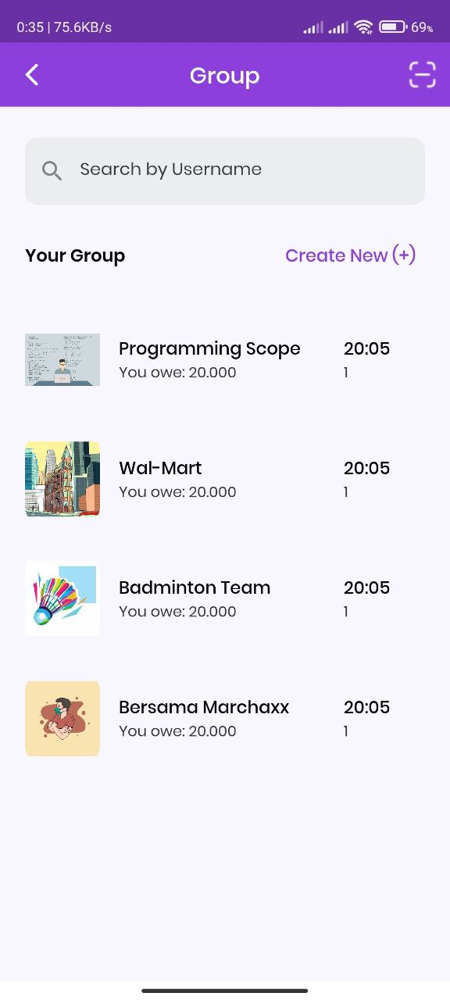

* History

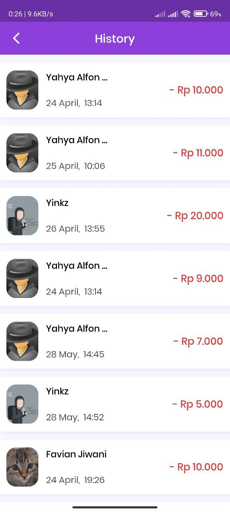

* Payment In/Out

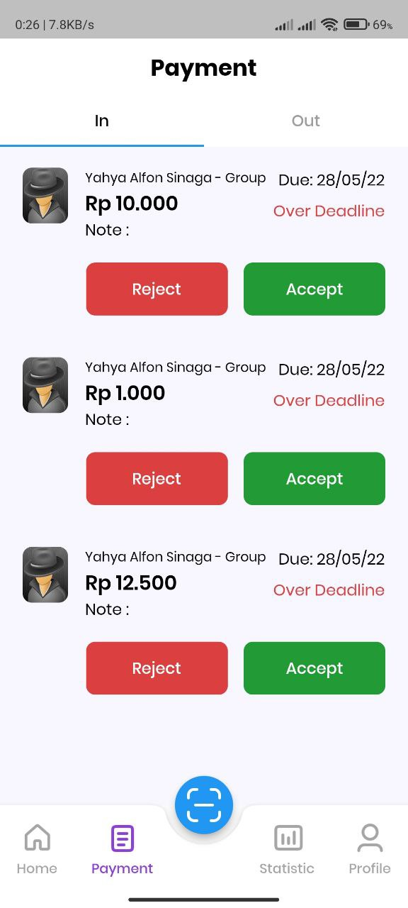

* Statistic

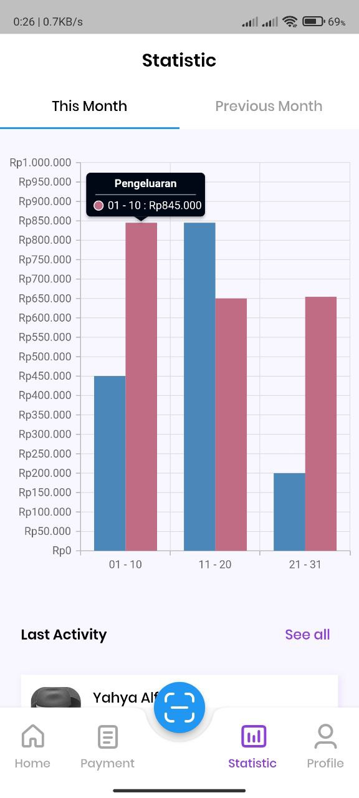

* Profile

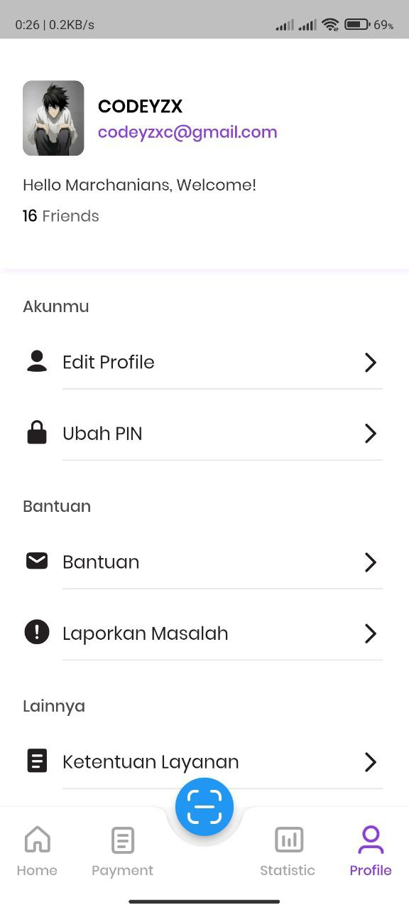

* Qr Scan

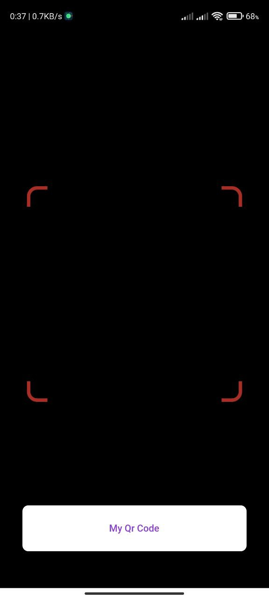

* Qr Code

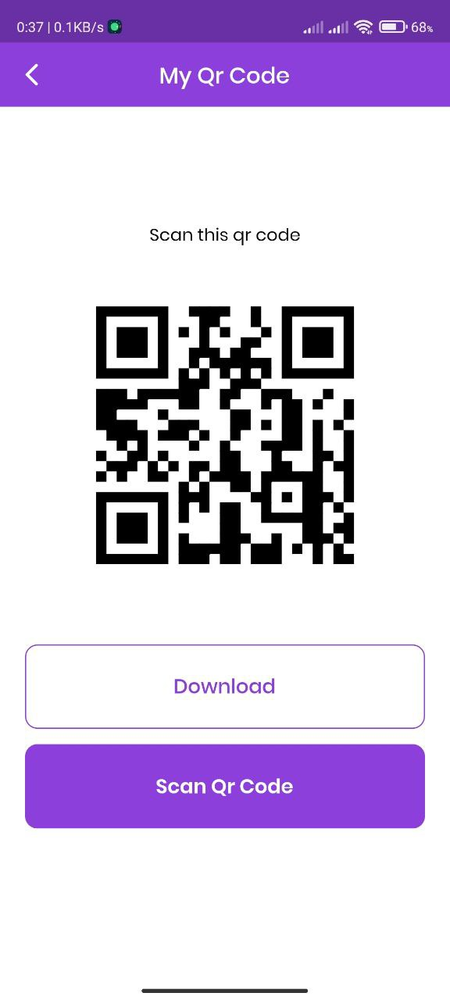

